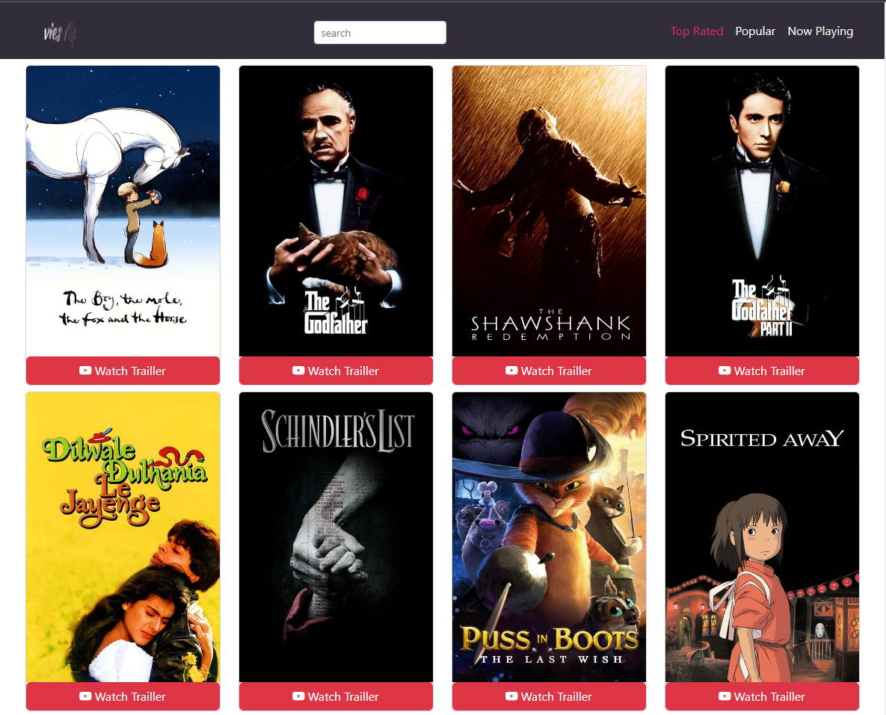
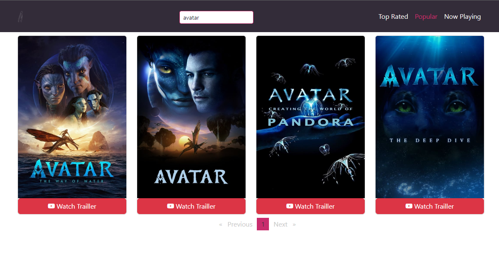
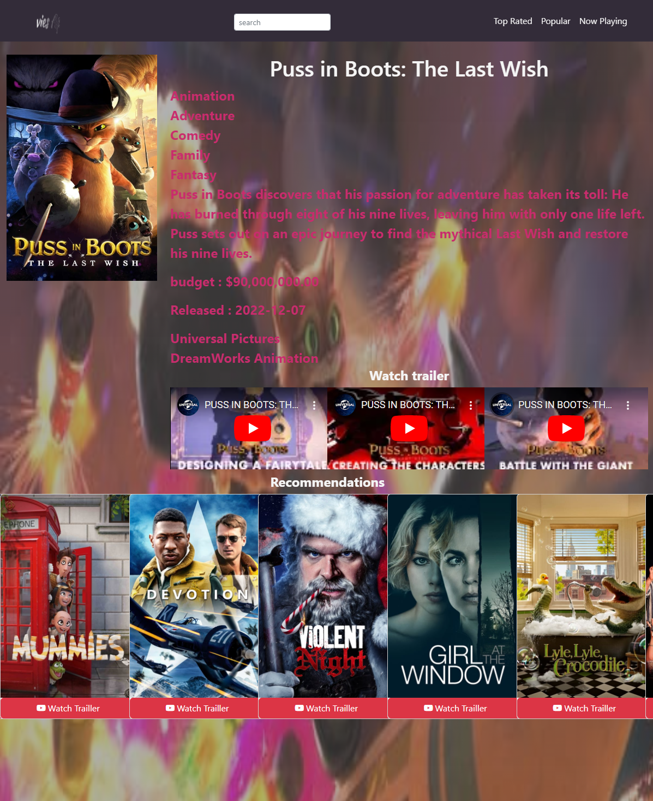

# MoviesApp

This project was generated with Angular CLI version 15.0.5.

## Dependencies

1- bootstrap 5.2.3
2- bootstrap-icons 1.10.3
3- ngx-owl-carousel-o 15.0.0
4- ngx-pagination 6.0.3

## Clone this repo to your devcie then run " npm install " to install dependencies

## Run `ng serve` for a dev server. Navigate to `http://localhost:4200/`. The application will automatically reload if you change any of the source files.

